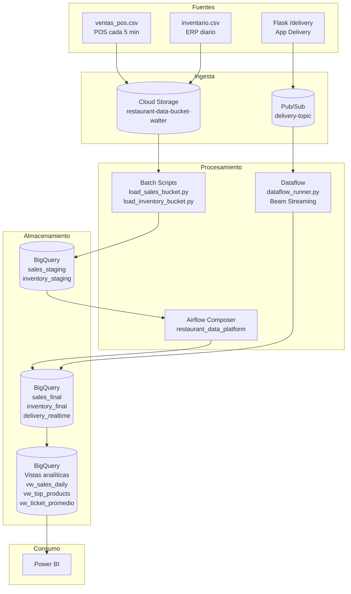

# Arquitectura — Restaurant Data Platform

## Flujo batch

1. CSV se suben a Cloud Storage (`data/` → `gs://restaurant-data-bucket-walter/`)
2. Scripts (`load_sales_bucket.py`, `load_inventory_bucket.py`) leen del bucket, validan, transforman y cargan a staging
3. Airflow DAG orquesta: load staging → MERGE a finales → ejecuta vistas analíticas
4. Vistas (`vw_sales_daily`, `vw_top_products`, etc.) disponibles para Power BI

## Flujo streaming

1. App Flask (`app.py`) recibe POST en `/delivery` y publica en Pub/Sub
2. Dataflow (`dataflow_runner.py`) consume desde la suscripción, deduplica por `pedido_id`, valida, y escribe a `delivery_realtime`
3. Datos disponibles en vistas analíticas

## Tecnologías

| Servicio | Uso |
|---|---|
| Cloud Storage | Almacenamiento CSV fuente |
| BigQuery | Data warehouse analítico |
| Pub/Sub | Mensajería streaming |
| Dataflow | Procesamiento streaming Beam |
| Cloud Composer | Orquestación batch |
| GitHub Actions | CI/CD |
| Docker | Contenedor Flask |
