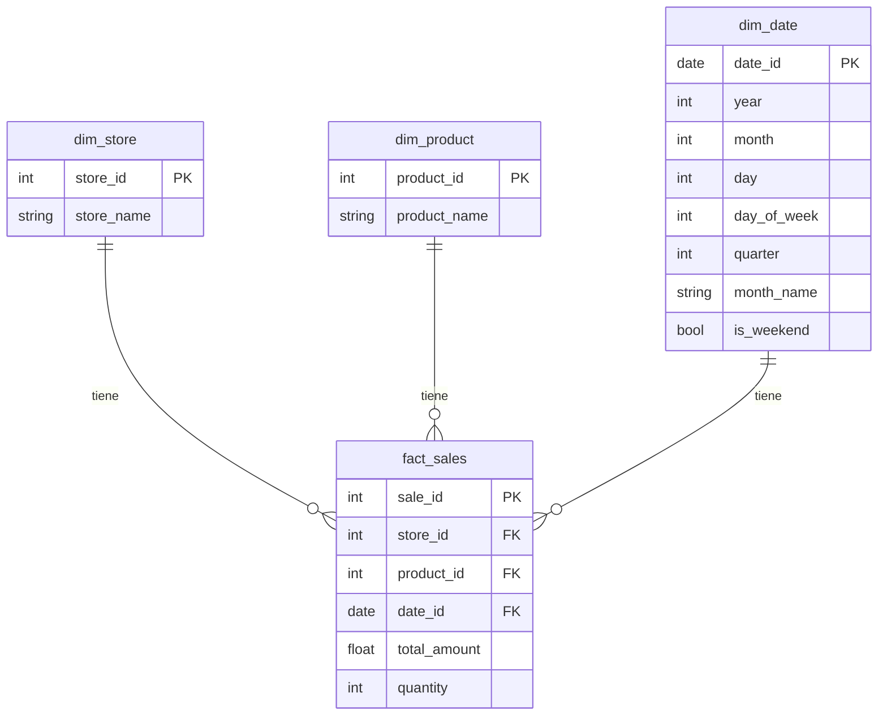

# Modelo Analítico — Star Schema

## Diagrama lógico



## DDL de tablas

El script `sql/create_tables.sql` crea las tablas operacionales (staging, final, delivery).

El script **`sql/warehouse_model.sql`** crea el star schema:

```sql
CREATE TABLE sales_analytics.dim_store (
    store_id INT64,
    store_name STRING
);

CREATE TABLE sales_analytics.dim_product (
    product_id INT64,
    product_name STRING
);

CREATE TABLE sales_analytics.dim_date (
    date_id DATE,
    year INT64,
    month INT64,
    day INT64,
    day_of_week INT64,
    quarter INT64,
    month_name STRING,
    is_weekend BOOL
);

CREATE TABLE sales_analytics.fact_sales (
    sale_id INT64,
    store_id INT64,
    product_id INT64,
    date_id DATE,
    total_amount FLOAT64,
    quantity INT64
);
```

## Poblado

El script **`sql/populate_star_schema.sql`** inserta datos desde `sales_final` hacia las dimensiones y hechos de forma idempotente (INSERT de solo lo nuevo, TRUNCATE + INSERT en fact).

Ejecución automática: el DAG de Airflow orquesta `load_staging → incremental → populate_star_schema → analytics_views`.

## Métricas disponibles

| Métrica | Vista |
|---|---|
| Venta total por tienda/día | `vw_sales_daily` |
| Productos más vendidos | `vw_top_products` |
| Ticket promedio por tienda | `vw_ticket_promedio` |
| Delivery summary | `vw_delivery_summary` |
| Consolidado ventas + delivery | `vw_consolidado` |
